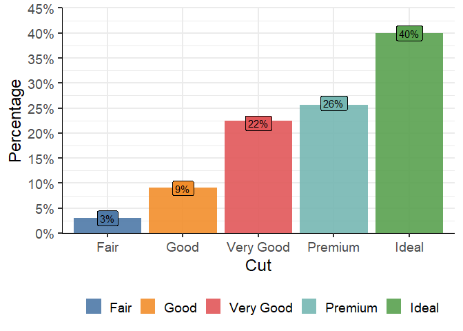

<!-- README.md is generated from README.Rmd. Please edit that file -->

# viskit

<!-- badges: start -->
<!-- badges: end -->

The goal of viskit is to make visualizations with ggplot quick and easy

## Installation

You can install the development version of viskit from
<https://github.com/aengels-git/viskit> with:

``` r
# install.packages("devtools")
devtools::install_github("aengels-git/viskit")
```

## Example

This is a basic example which shows you how to solve a common problem:

``` r
library(viskit)
tab<-diamonds%>%group_by(cut)%>%summarise(n=n())%>%
  mutate(prop=n/sum(n))
#> `summarise()` ungrouping output (override with `.groups` argument)
vis_barplot(tab,x = cut,y=prop,text = prop,
        col = cut,y_title = "Percentage",
        y_include = 0.45,y_breaks = scales::breaks_width(0.05),
        y_labels = function(x){scales::percent(x,accuracy = 1)})
#> i {ggblanket} converts unspecified titles using snakecase::to_sentence_case. Use
#> titles = ~.x to leave unspecified titles as is, and/or specify individual titles
#> manually using *_title arguments.i {ggblanket} merges col and fill aesthetics
#> into a single col aesthetic.
#> Warning: Ignoring unknown parameters: stat
#> Warning: Ignoring unknown aesthetics: text
```


